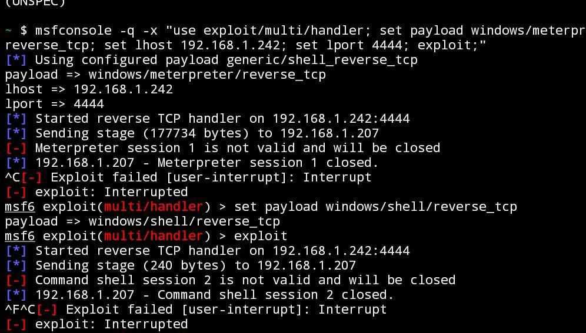
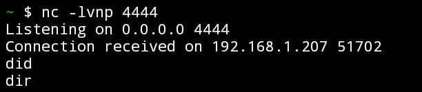

# Custom Reverse Shell c/cpp
Custom Reverse Shells in c/cpp via TCP or HTTPS, the https one is still work in progress.

# 💻 Code
A sample of a tcp reverse shell in c/cpp, creates a tcp socket given a target ip and port, establishes a connection, creates a ```cmd.exe``` process which will get as input whatever the attacker will write and will send back the output.
In the second sample i commented a portion of code which can be used to resolve addresses, for example in cases of port forwarding, or dns related issues.

How to compile:
``` gcc -o rev.exe rev.c -lws2_32 ```

If you want to extract the shellcode, the fastest way is in my opinion on gitbash:
``` xdd -i rev.exe rev2.c ```




But unlike meterpreter or similar framework payloads, the shellcode extracted here is like 30.000 lines long, which means its basically unusable. Also it's easily detected by Windefender : (  
Here is an example of me trying to use it with metasploit not knowing that only meterpreter shells can be used with msfconsole: 

You can instead use it with netcat as listener: ``` nc -nlvp 4444``` and sometimes it works :D \

